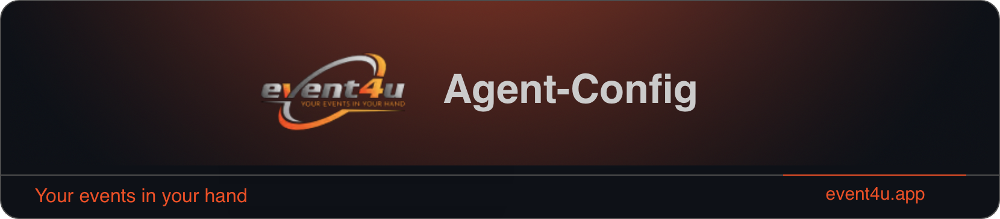

<p align="center"><a href="https://event4u.app"></a></p>

# Agent Config — Governed skills, rules & work journeys for AI coding agents

[](https://github.com/event4u-app/agent-config/actions/workflows/smoke.yml) [](https://github.com/event4u-app/agent-config/actions/workflows/smoke-public-install.yml) [](https://www.npmjs.com/package/@event4u/agent-config) [](https://glama.ai/mcp/servers/event4u-app/agent-config)

> **Choose your experience — developer · founder · content · agency · finance · ops. Add packs. Get a focused command set, not a 500-artefact dump.** Bring your own AI provider.

Six role-shaped entry paths, one shared **skills + rules + commands** layer that turns any host agent (Claude Code, Augment, Cursor, Copilot, Windsurf) into a reliable team member — without locking you to a single model or vendor.

### What's different

Three things this package ships that a README scan slides right past:

- **Surgical uninstall** — removes only its own keys from a shared host config (matched by JSON-pointer + SHA-256), never a neighbour tool's entries.
- **Pack-scoped install** — writes the active pack only, not a 500-artefact dump.
- **Portability guard** — works in any project; source confidentiality is CI-enforced.

See exactly [what works on which host](docs/capability-matrix.md), or jump to [things you can do in a minute](docs/cookbook.md).

### Pick your profile — six entry paths

`agent-config setup` writes `profile.id` to `.agent-settings.yml`; each
anchor below is the first-screen the wizard sends you to. One README,
six entries, no role-detection guesswork.

| Profile (`profile.id`) | Audience | First commands | First skills |
|---|---|---|---|
| 👩‍💻 [`developer`](docs/profiles.md#profile-developer) | IC engineer | `/implement-ticket` · `/work` · `/review-changes` · `/fix` · `/commit` | `developer-like-execution` · `verify-completion-evidence` · `minimal-safe-diff` · `systematic-debugging` · `test-driven-development` |
| ✍️ [`content_creator`](docs/profiles.md#profile-content_creator) | Writers, ghostwriters, marketers | `/work` · `/post-as` · `/ghostwriter` · `/optimize-prompt` · `/video:from-script` · `/video:storyboard` | `voice-and-tone-design` · `messaging-architecture` · `editorial-calendar` · `release-comms` · `character-consistency` |
| 🚀 [`founder`](docs/profiles.md#profile-founder) | Solo / early-stage founder | `/work` · `/feature` · `/challenge-me` · `/council` | `refine-prompt` · `rice-prioritization` · `vision-articulation` · `fundraising-narrative` · `runway-cognition` |
| 🏛 [`agency`](docs/profiles.md#profile-agency) | Multi-client delivery shop | `/work` · `/implement-ticket` · `/refine-ticket` · `/feature` · `/roadmap` | `doc-coauthoring` · `decision-record` · `refine-ticket` · `estimate-ticket` · `perf-feedback-craft` |
| 💼 [`finance`](docs/profiles.md#profile-finance) | CFO / fractional finance / FP&A | `/work` · `/council` · `/challenge-me` | `dcf-modeling` · `forecasting` · `scenario-modeling` · `unit-economics-modeling` · `runway-cognition` |
| 🛡 [`ops`](docs/profiles.md#profile-ops) | RevOps, support, SRE-adjacent | `/work` · `/threat-model` · `/review-changes` · `/fix` | `incident-commander` · `dashboard-design` · `logging-monitoring` · `threat-modeling` · `launch-readiness` |

**Not sure which one?** Run `npx @event4u/agent-config init` then
`agent-config setup` — the browser wizard asks a single 8-option role
question and maps to the closest profile. Source-of-truth:
[`src/agent-src/profiles/`](src/agent-src/profiles/) ·
schema: [`docs/contracts/profile-system.md`](docs/contracts/profile-system.md).
Beyond software: [`user-types/`](src/agent-src/user-types/)
(galabau · metalworking · truck — see [Beyond software](#beyond-software).

**Per-profile experience pages** (who it's for · first tasks · packs + flows ·
what is *not* loaded · examples):
[developer](docs/experiences/developer.md) ·
[content_creator](docs/experiences/content_creator.md) ·
[founder](docs/experiences/founder.md) ·
[agency](docs/experiences/agency.md) ·
[finance](docs/experiences/finance.md) ·
[ops](docs/experiences/ops.md).

### Workflows, not raw commands

You don't memorize 150 commands — you run a **work journey**. Four flows span the
developer story end-to-end; each names the command you TYPE to start and the
skills it composes:

| Flow | Start with | The journey |
|---|---|---|
| 🔍 **Discovery** | `/feature:plan` · `/research` | explore → plan → estimate → refine, *before* building |
| 🔨 **Implementation** | `/work` · `/implement-ticket` | plan → implement → verify → commit |
| 🔎 **Review** | `/review-changes` · `/judge` | self-review → judge → quality-fix → threat-model |
| 🚢 **Delivery** | `/commit` · `/pr:create` | commit in chunks → open PR → answer review |

Full detail — entry commands, canonical path, composed skills per flow:
[`docs/flows.md`](docs/flows.md). (`agent-admin` — memory / analytics / config —
is platform operation, not a user-work flow.)

<p align="center">
  <a href="CHANGELOG.md">CHANGELOG</a> ·
  <a href="MIGRATION.md">Upgrade to 6.0</a> ·
  <a href="CHANGELOG.md#breaking--v400-unified-setup-road-to-unified-setup">Breaking changes</a> ·
  <a href="https://github.com/event4u-app/agent-config/releases/latest">Latest release</a> ·
  <a href="https://github.com/event4u-app/agent-config/discussions">Discussions</a>
</p>

<p align="center">
  <sub>Distribution: <code>npm install @event4u/agent-config</code>. Major bumps follow <a href="CONTRIBUTING.md#versioning-policy">semver</a>; each ships a <a href="CHANGELOG.md#breaking--v400-unified-setup-road-to-unified-setup"><code>### Breaking</code></a> entry — all majors indexed in <a href="BREAKING_CHANGES.md">BREAKING_CHANGES.md</a>.</sub>
</p>

---

> **Creative Pack — cinematic AI video.** script → character-locked image → motion+audio prompt → provider render → stitched clip, with `AIV_DRYRUN=true` as the cost-safety default. A first-class capability inside the **content / creator** experience — no longer the package's headline. See [`/video:from-script`](.augment/commands/video/from-script.md).

<details>
<summary><b>Catalog at a glance</b> — raw artefact counts (maintainer reference)</summary>

[](dist/agent-src/skills/) [](dist/agent-src/rules/) [](dist/agent-src/commands/) [](docs/guidelines/) [](dist/agent-src/personas/) [](dist/agent-src/personas/advisors/)

The headline is the **experience** (profile + packs), not the raw counts. Full catalog: [`docs/catalog.md`](docs/catalog.md).
</details>

## Use it in your project

Run from a consumer repo — bootstrap via `npx`, the agent picks up
your stack, and you ship work end-to-end. New install? Start with the
[Quickstart](#quickstart). Already installed? [Supported tools](#supported-tools)
shows the wired AIs; [`docs/featured-commands.md`](docs/featured-commands.md)
lists the end-to-end workflows (`/implement-ticket`, `/work`,
`/commit`, `/pr:create`). Deeper tour: [2-minute demo](#2-minute-demo--implement-ticket).

**Install scope.** Pick **one** scope per machine — project-local (default, recommended for application repos) or user-global (recommended for tooling repos / dotfiles). The installer refuses a second, conflicting scope via the `scope_guard` pre-flight. Details: [`docs/contracts/install-scopes.md`](docs/contracts/install-scopes.md). Cleanup when needed: `bash scripts/cleanup_other_scope.sh --confirm`.

## Prove it

Audit-disciplined by construction — every memory consult, decision
key, and hook concern lands in `agents/runtime/state/` so you can replay it.
[Core principles](#core-principles) names the four invariants;
[What `agent-config` is — and what it isn't](#what-agent-config-is--and-what-it-isnt)
draws the scope boundary.

## Contribute

Working on the package itself? [Development](#development) covers the
`task ci` pipeline, [Requirements](#requirements) the toolchain,
[Maintainer telemetry](#maintainer-telemetry-opt-in-default-off) the
opt-in measurement loop. Source-of-truth tree is
`src/` (`src/skills`, `src/rules`, `src/agent-src/`); never hand-edit `.augment/` or `dist/agent-src/`.

**Security.** Disclosure policy: [`SECURITY.md`](SECURITY.md). Threat model: [`docs/threat-model.md`](docs/threat-model.md).

---

## Quickstart

**Three steps. Five minutes. Browser wizard, no YAML by hand.**

```bash
# 1. Install — on a terminal with a display, the browser wizard launches
#    automatically; the same install.py runs the real install behind it.
npx -y @event4u/agent-config init

# 2. Pick your profile + tools in the wizard, click Finish.
#    (Writes ~/.event4u/agent-config/, ~/.claude/, ~/.cursor/, …)

# 3. First real task — agent refines, plans, verifies.
/work "your first real task"
```

**Headless / CI:** `init` skips the GUI automatically when `CI` is set, stdout is not a TTY, `--no-ui` is passed, **or** an explicit `--tools=` selection is given — it then runs the non-interactive installer directly. Pass flags (`--profile=developer --tools=claude-code,cursor`); add `--dry-run` to preview writes. The GUI and the CLI share one installer (`scripts/install.py`), so both produce identical results. Reference: [`docs/wizard.md`](docs/wizard.md).

**Pick specific AIs:** `--tools=claude-code,cursor,augment,windsurf,cline,gemini-cli,copilot,roocode,aider,codex,claude-desktop,continue` (any subset). Visual picker: add `--gui` (loopback-bound, CSRF-gated; contract [`gui-wizard`](docs/contracts/gui-wizard.md)).

**Verify hook coverage:** `npx @event4u/agent-config hooks:status` prints the per-platform matrix (`--strict` for CI, `--format json` for tooling).

> **Scope (v2.5+):** `init` writes **global** only — `~/.event4u/agent-config/`, `~/.claude/`, `~/.cursor/`, …. The project tree gets `agents/overrides/` + `agents/.event4u-bridge.yml`. `--project` is maintainer-only behind `AGENT_CONFIG_DEV_MODE=1` ([ADR-020](docs/decisions/ADR-020-global-only-consumer-scope.md), [dev-mode](docs/maintainers/dev-mode.md)).

Migrating from a v1.x install? `npx @event4u/agent-config migrate` — full notes in [`docs/migration/v1-to-v2.md`](docs/migration/v1-to-v2.md).

> **`npm error ETARGET` / `No matching version found for <dep>`?** Re-run with a
> forced fresh metadata fetch:
> ```bash
> npx -y --prefer-online @event4u/agent-config init
> ```
> This happens when the project's `.npmrc` sets `prefer-offline=true` (or points
> at a private-registry mirror): npm resolves our dependencies against stale
> cached metadata that predates a recently published version. `--prefer-online`
> bypasses the cache for this run; `npm cache verify` fixes it permanently for
> that machine.

---

## What `agent-config` is — and what it isn't

A **content layer** — skills, rules, commands, guidelines, personas — distributed via npm and projected into every supported AI tool's native config format. It follows the [Agent Skills open standard](https://agentskills.io).

It is **not** an agent runtime. The agent loop, the LLM dispatcher, and tool orchestration stay with the host tool (Claude Code, Augment, Cursor, Cline, Windsurf, Gemini CLI, Copilot). Think of it as a playbook and style guide for those tools — not a replacement.

| In scope | Out of scope |
|---|---|
| Skills, rules, commands, guidelines, personas | Agent loop / LLM dispatcher |
| Multi-tool projection + condensation pipeline | Execution engine inside the package |
| Memory helpers (`memory-add`, `memory-promote`) | Cross-tool observability dashboard |
| Linters, CI, frontmatter validation against [JSON-Schema](scripts/schemas/) ([contract](agents/reference/docs/frontmatter-contract.md)) | Runtime GUI / web dashboard |
| Skill orchestration via citations + deterministic helpers | Opinionated *automatic* skill-resolver (ML / relevance ranking that decides for you) |
| User-driven projection-time filtering by profile + packs ([ADR-040](docs/decisions/ADR-040-execution-model-projection-time-filtering.md)) | A *runtime* resolver / daemon (mid-session switching — conditional, post-6.0.0) |

### What your agent is asked to do

| Default behavior | With agent-config |
|---|---|
| Guess and edit blindly | Analyze code before changing it |
| Drift from project conventions | Follow detected stack conventions |
| Skip or invent tests | Write tests in the project's framework |
| Generic commit messages | Conventional Commits with scope + ticket links |
| Skip quality checks | Run the project's quality pipeline and fix reported errors |
| Open PRs without context | Structured PR descriptions from Jira / Linear / GitHub |
| Claim "done" without proof | Verify with real execution before claiming done |

---

## 2-minute demo — `/implement-ticket`

The flagship command. Drives a ticket end-to-end through a fixed linear flow — and **blocks on ambiguity instead of guessing**.

```
/implement-ticket PROJ-123
```

The agent runs this sequence:

```
refine → memory → analyze → plan → implement → test → verify → report
```

- **Refines** the ticket if acceptance criteria are vague.
- **Queries memory** for past decisions, invariants, incidents.
- **Plans** the change; you confirm before any file is touched.
- **Implements** under `minimal-safe-diff` + `scope-control` — no drive-by edits.
- **Tests** (targeted first, full suite on success).
- **Reviews** the diff through four judges (bugs, security, tests, code quality).
- **Reports** changes, verdicts, follow-ups — then stops. `/commit` and `/pr:create` are suggestions, never auto-run.

Any ambiguity halts the flow with numbered options — never a silent guess. Persona comes from `.agent-settings.yml` (`roles.active_role`): `senior-engineer` (default), `qa`, or `advisory` (plan-only).

→ [Command reference](dist/agent-src/commands/implement-ticket.md) · [Flow contract](docs/contracts/implement-ticket-flow.md)

### Sibling — `/work` (free-form prompt)

Same engine, no ticket required:

```
/work add a CSV export endpoint to the audit-log controller
```

The first pass scores the prompt on five dimensions and routes on the band:

| Band | Score | Action |
|---|---|---|
| **high** | `≥ 0.8` | Silent proceed — AC + assumptions in the report |
| **medium** | `0.5–0.79` | Halts with assumptions report; confirm or edit |
| **low** | `< 0.5` | Halts with **one** clarifying question on the weakest dimension |

After the band gate, the flow is identical to `/implement-ticket`. Free-form goal → `/work`; ticket payload → `/implement-ticket`.

→ [Command reference](dist/agent-src/commands/work.md) · [`refine-prompt` skill](dist/agent-src/skills/refine-prompt/SKILL.md)

**After the run:** `agent-config explain last` reconstructs the trace (route · memory · council · halts · provider) — read-only, PII-scrubbed, offline. [Docs](docs/customization.md#explainability--explain-last)

### Product UI track

UI-shaped work routes to one of three directive sets — `ui` (full audit→design→apply→review→polish→report), `ui-trivial` (≤ 1 file, ≤ 5 lines: apply→test→report), `mixed` (backend + UI: contract→ui→stitch). Existing-UI audit is a **hard gate** ([`ui-audit-gate`](dist/agent-src/rules/ui-audit-gate.md)); polish has a 2-round ceiling with a11y precedence. Stack detection → `blade-livewire-flux` / `react-shadcn` / `vue` / `plain`.

→ [Mental model](docs/ui-track-mental-model.md) (1 page) · [Flow contract](docs/contracts/ui-track-flow.md)

---

## Customize

### Profiles — how much governance gets loaded

Safety floor (non-destructive defaults · ask-before-guessing · mirror-the-user's-language) ships in **every** profile. What changes is how much extra coaching gets pulled in.

| Profile | What you get | When to pick it |
|---|---|---|
| **`minimal`** | Non-negotiable safety floor only. Cheapest, fastest. | Quick questions · throw-away scripts · CI · tight token budgets |
| **`balanced`** (default) | Safety floor + everyday coaching (sensible defaults, review nudges, common pitfalls). | Day-to-day work |
| **`full`** | Everything, including long-tail rules normally only maintainers need. | Working on `agent-config` itself · audits · max-fidelity demos |

Under the hood: kernel-only · kernel + tier-1 · kernel + tier-1 + tier-2. Details: [`rule-router`](docs/contracts/rule-router.md) · [`kernel-membership`](docs/contracts/kernel-membership.md) · [Configure →](docs/customization.md).

> **Stability:** [`STABILITY.md`](docs/contracts/STABILITY.md) for the full matrix. Work Engine (`/work` + `/implement-ticket`): **beta**. Runtime Dispatcher: **stable**. Tool Adapters: **experimental** (`full` profile only).

### `.agent-user.md` and Ghostwriter — voice primitives

| Primitive | Voice | Disclosure |
|---|---|---|
| [`personas/*.md`](dist/agent-src/personas/) | Review-lens (internal critique) | n/a |
| `.agent-user.md` (project root, gitignored) | The maintainer's own voice — `/post-as:me` | None (you are the author) |
| [`agents/reference/ghostwriter/<slug>.md`](docs/contracts/ghostwriter-schema.md) (gitignored) | Documented public figure — `/post-as:ghostwriter` | **Mandatory, non-removable** footer |

Create the user file interactively: `/agents user init` ([schema](docs/contracts/agent-user-schema.md)). Ghostwriter cluster: `/ghostwriter:fetch <url-or-name>` runs an attestation gate; private individuals rejected; paywalled / leaked / DM content banned at the schema level.

### Self-hosted MCP on Cloudflare — zero local install

Skills, commands, rules, and guidelines can be served as an MCP endpoint from your own Cloudflare Worker — any MCP client (Claude Desktop, Claude Code, Cursor, Zed, Continue, hosted agents) talks to it over HTTP. Two auth modes: `public` (default, OSS read-only deploys) and `bearer-auth` (operator opt-in, `MCP-Token` Wrangler secret).

```bash
task mcp:cloud:login         # one-time, opens browser
task mcp:cloud:setup         # check → r2-create → r2-verify → whoami
task mcp:cloud:secret-put    # opt in to bearer-auth (recommended for private deploys)
```

→ Operator walkthrough: [`mcp-cloud-setup`](docs/setup/mcp-cloud-setup.md) · Per-client config: [`mcp-client-config`](docs/setup/mcp-client-config.md) · Endpoints: [`mcp-cloud-endpoints`](docs/setup/mcp-cloud-endpoints.md).

> **Scope — Lite, not Full.** The Worker serves read-only governance (skills · commands · rules · guidelines · contexts) as MCP prompts and resources, plus small read-only tools (`memory_lookup`, `chat_history_read`, `list_*`). It does **not** execute the ~112 Python scripts (linters, audits, `task ci`, work-engine hooks) — those require local install per [Quickstart](#quickstart).

> The built-in **local stdio** server is listed for discovery in the [Glama MCP Registry](https://glama.ai/mcp/servers/event4u-app/agent-config) (agent developers / contributors; requires a local checkout, not a turnkey install — see [ADR-067](docs/decisions/ADR-067-glama-registry-listing.md)).

### Deployment posture

| Shape | Status | Path |
|---|---|---|
| **Single-user workspace** | ✅ today | `npx @event4u/agent-config init` — single machine, single user; no remote sync |
| **Small team (3–10 people)** | ✅ today | Shared `agents/overrides/` Git repo + shared NAS for knowledge — no code change, no new server. Recipe: [`docs/deploy/small-team-recipe.md`](docs/deploy/small-team-recipe.md) |
| **Organization mode** (SSO · central policy · team context · internal connectors) | ⏸ not started | Each shape gated on a recruited customer + funded audit + maintainer ADR. Posture rationale: [`docs/deploy/team-deployment-posture.md`](docs/deploy/team-deployment-posture.md) |

The Hard Floor on organization-mode features (SSO, central policy, OAuth connectors, team-context) is preserved by design — they stay cancelled until a real first customer + funded security audit lifts them. The small-team recipe is the supported path in the meantime.

> *The 9.3/10 feedback round (2026-05-25) re-asked for OAuth knowledge connectors, IAM / org governance, and organization-shared memory. Each is a stable cancellation row in [`team-deployment-posture`](docs/deploy/team-deployment-posture.md) under the same three release gates — recruited team customer · funded audit · maintainer ADR.*

---

## Harness expectations

Three classes of install/runtime behaviour look like package bugs but are host-harness behaviour the package cannot control — sibling-plugin namespaces (`codex:*`, `cc-gemini-plugin:*`), deferred tools surfaced via `ToolSearch`, and cross-scope skill drift (real bug, fixed in the distribution-channels track). Diagnostics + the package's response: [`docs/contracts/harness-expectations.md`](docs/contracts/harness-expectations.md). First step when a skill appears twice: `task probe:skills`.

## Supported tools

### Project-installed (`npx`)

| Tool | Rules | Skills | Commands | How it works |
|---|---|---|---|---|
| **Claude Code** | ✅ | ✅ | ✅ | Reads `.claude/` |
| **Cursor** | ✅ | — | ☑️ | Reads `.cursor/rules/` + commands via AGENTS.md |
| **Cline** | ✅ | — | ☑️ | Reads `.clinerules/` + commands via AGENTS.md |
| **Windsurf** | ✅ | — | ☑️ | Reads `.windsurfrules` + commands via AGENTS.md |
| **Gemini CLI** | ✅ | — | ☑️ | Reads `GEMINI.md` |
| **GitHub Copilot** | ✅ | — | ☑️ | Reads `.github/copilot-instructions.md` |
| **Roo Code** | ✅ | — | ☑️ | Auto-discovers `.roo/rules/*.md` + AGENTS.md |
| **Codex CLI** | ✅ | — | ☑️ | Auto-discovers `AGENTS.md` |
| **Continue.dev** | ✅ | — | ☑️ | Auto-discovers `.continue/rules/*.md` + AGENTS.md |
| **Aider** | 📌 | — | — | Manual `read:` in `.aider.conf.yml` |
| **Augment** (VSCode/IntelliJ) | 📌 | — | — | Global-only; project writes marker |
| **Claude Desktop** | 📌 | — | — | Global-only |

✅ native &nbsp; ☑️ text reference (in AGENTS.md, not invokable as native slash-command) &nbsp; 📌 marker only &nbsp; — not available

> **Team reproducibility:** every tool you `init` is recorded in `agents/installed-tools.lock` (committed, machine-managed). New team members run `npx @event4u/agent-config sync` after cloning; CI gates drift with `agent-config validate`. Schema: [`installed-tools-manifest`](docs/guidelines/agent-infra/installed-tools-manifest.md).

### Plugin-installed (optional, global)

| Tool | Install |
|---|---|
| **Augment CLI** · **Claude Code** · **Copilot CLI** | [Install →](docs/installation.md) — rules + skills + commands, marketplace-updated |

Keep the global install current with `agent-config upgrade` (latest) or
`agent-config refresh --global` (same-version re-install); `agent-config doctor`
flags a missing-from-`PATH` binary or binary↔plugin version drift. See
[getting-started § Keeping current](docs/getting-started.md#keeping-current).

### Cloud / Hosted-agent surfaces

For platforms where the package's scripts cannot run, artefacts are built for paste-in or upload:

- **Linear AI** (Codegen, Charlie, …) — `dist/linear/{workspace,team,personal}.md`
- **Claude.ai Web Skills** — `dist/cloud/<skill>.zip`

→ [Install →](docs/installation.md#linear-ai-codegen-charlie-)

---

## Who this is for

Stack-agnostic governance core (orchestration · role modes · command clusters · quality gates · audit-discipline) plus parallel stack-specific skill sets:

| Stack | Coverage |
|---|---|
| **Laravel · modern PHP** (deepest) | Pest · PHPStan · Rector · ECS · Eloquent · Livewire/Flux · Horizon · Pulse · Reverb · Pennant |
| **Symfony** | `symfony-workflow` (DI · Doctrine · Messenger · voters · Twig) + project-analysis |
| **Next.js App Router** | `nextjs-patterns` (RSC · Server Actions · caching · route handlers) + UI `react-shadcn` |
| **Zend / Laminas** | project-analysis + shared PHP coder/quality skills |
| **React · Node / Express** | project-analysis + UI `react-shadcn` |
| **Vue · plain HTML** | UI directive set (`vue` / `plain`) |
| **Cross-stack** | API design · testing · security · database · Docker · Git · CI · review · threat modeling · observability |

### Beyond software

The same orchestration core drives non-software trades via [`user-types/`](src/agent-src/user-types/): [`galabau-field-crew`](src/agent-src/user-types/galabau-field-crew.md) · [`metalworking-shop`](src/agent-src/user-types/metalworking-shop.md) · [`truck-driver`](src/agent-src/user-types/truck-driver.md). Contribute your own — [5-minute scaffold](src/agent-src/user-types/_template/).

---

## Data governance & domain safety

Three domain-safety rules ([`domain-safety-pii`](src/rules/domain-safety-pii.md), [`domain-safety-disclaimer`](src/rules/domain-safety-disclaimer.md), [`domain-safety-retention`](src/rules/domain-safety-retention.md)) act as per-domain output floors across ~12 areas — PII redaction (support / finance / recruiting / marketing), advice disclaimers (legal / financial / medical / consulting), retention guidance (finance / support), ops floors (logging / export). Full surface → rule → floor matrix: [`docs/safety.md`](docs/safety.md). Beta contracts: [`memory-visibility-v1`](docs/contracts/memory-visibility-v1.md) · [`decision-trace-v1`](docs/contracts/decision-trace-v1.md).

### Maintainer telemetry (opt-in, default-off)

Local-only artefact-engagement log. Set `telemetry.artifact_engagement.enabled: true` in `.agent-settings.yml`. Records which skills / rules / commands / guidelines the agent consults during `/implement-ticket` / `/work`. JSONL under the project root, nothing uploaded. Reports: `npx @event4u/agent-config telemetry:report`.

### Context-aware command suggestion

When a prompt matches a command's purpose ("setze ticket ABC-123 um" → `/implement-ticket`), the agent surfaces matches as numbered options — **nothing auto-executes**. Per-conversation off: `/command-suggestion-off`. Settings: `commands.suggestion.{enabled,blocklist,confidence_floor}` in `.agent-settings.yml`.

---

## Core principles

- **Analyze before implementing** — no guessing, no blind edits
- **Verify with real execution** — no "should work"
- **Challenge to improve** — agents are thought partners, not yes-machines
- **Strict by design** — quality over flexibility
- **Zero overhead by default** — nothing runs until you ask for it

---

## Documentation

| Document | Content |
|---|---|
| [**Getting Started**](docs/getting-started.md) | First run, 3-test experience, profiles, next steps |
| [**Installation**](docs/installation.md) | All install paths, Composer/npm, orchestrator details |
| [**Architecture**](docs/architecture.md) | System layers, content pipeline, tool support matrix |
| [**Customization**](docs/customization.md) | Overrides, AGENTS.md, agent settings, cost profiles |
| [**Quality & CI**](docs/quality.md) | Linting, CI pipeline, condensation system |
| [**Migration**](docs/MIGRATION.md) | Per-version upgrade steps |
| [**Showcase**](docs/showcase.md) | More examples & expected behavior |

Browse content: [all 155 commands](dist/agent-src/commands/) · [skills catalog](docs/skills-catalog.md) · [full catalog](docs/catalog.md) · [`llms.txt`](llms.txt).

---

## Development

Working on the package itself? Edit `src/` (the source of truth — `src/skills`, `src/rules`, `src/agent-src/`), regenerate trees:

```bash
task sync             # regenerate dist/agent-src/ and .augment/
task generate-tools   # regenerate .claude/, .cursor/, .clinerules/, .windsurfrules
task ci               # full pipeline — green before PR
task test             # unit + integration tests
task dev:setup        # boot the onboarding wizard against the working tree
```

**Invoking the CLI from a source checkout:** `./agent-config <command>` (the maintainer shim at the repo root → `scripts/agent-config` → `dist/cli/agent-config.js`). `npx @event4u/agent-config` doesn't resolve in the source repo without a prior `npm link`, since there's no `node_modules/.bin/agent-config` symlink — use `./agent-config` instead. Build the TS binary with `npm run build:cli` if `dist/cli/agent-config.js` is missing.

→ Full project structure and commands: [**docs/development.md**](docs/development.md) · [CONTRIBUTING.md](CONTRIBUTING.md). Stack: **TypeScript** CLI/UI + **Python 3.10+** build/lint scripts. MCP registry payloads render under `dist/mcp/` ([submission checklist](docs/distribution/mcp-submission-checklist.md)).

---

## Requirements

- **Node ≥ 18** — `npx @event4u/agent-config init` is the canonical install path.
- **Python 3.10+** — bridge stage only; missing → installer skips bridges.
- **Platform:** macOS 12.3+, Linux, WSL2. Git Bash needs Developer Mode for symlinks; native PowerShell / cmd unsupported. Contributors rebuilding `.augment/` also need [Task](https://taskfile.dev/).

## License

[MIT](LICENSE).
