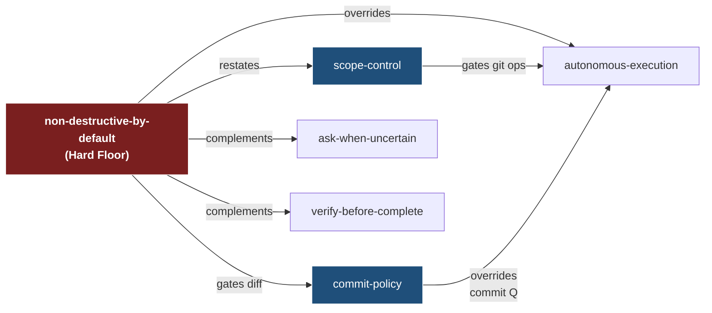

# Rule-Interaction Matrix

> **Audience:** rule authors and reviewers — anyone editing
> `.agent-src.uncompressed/rules/*.md` or proposing a new always-rule.
> **Authoritative source:** [`rule-interactions.yml`](rule-interactions.yml).
> **Linter:** `scripts/lint_rule_interactions.py` (run via `task lint-rule-interactions`).

The matrix captures how the package's `always` rules relate when more
than one fires on the same turn. It exists because rules at this size
(55 rules, ~49k tokens budget) develop emergent precedence relationships
that no single rule file can document on its own.

The anchor pair is `non-destructive-by-default` — the universal safety
floor — paired with the five rules most likely to be invoked in the
same turn:

- `autonomous-execution` — autonomy never lifts the floor.
- `scope-control` — git-ops permission gate; floor is the never-overridable subset.
- `commit-policy` — four exception paths to commit; floor still gates the diff content.
- `ask-when-uncertain` — both rules push toward the same response on a destructive ambiguous request.
- `verify-before-complete` — independent gates; both must be satisfied.

## Diagram



## Relations

The YAML uses six relation kinds. Definitions:

| Relation | Meaning |
|---|---|
| `overrides` | Senior rule's outcome wins when both fire — junior's permission cannot proceed past senior's stop. |
| `narrows` | Senior shrinks the surface area on which junior applies, but does not stop it. |
| `defers_to` | Junior explicitly hands over to senior on the overlapping surface. |
| `restates` | The two rules cover overlapping ground intentionally — the restatement prevents future weakening of one side. |
| `gates` | Senior fires *in addition to* junior on a specific subset, not instead of. |
| `complements` | Both rules independently apply; outcomes are additive and harmonious. |

## Reading a pair entry

```yaml
- id: ndd-x-autonomous-execution
  rules: [non-destructive-by-default, autonomous-execution]   # senior, junior
  relation: overrides
  conflict: …                                                  # what triggers both
  resolution: …                                                # what the agent does
  evidence:
    - .agent-src.uncompressed/rules/non-destructive-by-default.md#the-iron-law
    - .agent-src.uncompressed/rules/autonomous-execution.md#hard-floor--see-non-destructive-by-default
```

`rules: [a, b]` is ordered: `a` is senior (wins on conflict), `b` is
junior (yields). For `complements`, ordering is documentary only.

## Adding a new pair

1. Edit `rule-interactions.yml`, append a pair under `pairs:` with all
   six required fields.
2. Add both rule slugs to the top-level `rules:` block if not already
   listed.
3. Run `task lint-rule-interactions` — must exit 0.
4. Update the Mermaid diagram above if the pair is anchor-relevant
   (involves `non-destructive-by-default` or one of its five partners).
5. Reference the matrix from the rule files that are involved (one
   line each — the matrix is the source, not the rules).

## When **not** to add a pair

- Two rules that never fire on the same turn — no interaction means
  no entry; the matrix is for *active* relationships.
- Documentation-only cross-references (e.g. "see also") — those stay
  in the rule files.
- Skill ↔ rule interactions — the matrix is rule-only. Skills are
  invoked, not always-active.

## See also

- [`docs/contracts/STABILITY.md`](STABILITY.md) — public-surface stability tiers.
- [`docs/contracts/adr-chat-history-split.md`](adr-chat-history-split.md) — ADR pattern for major rule structural changes.
