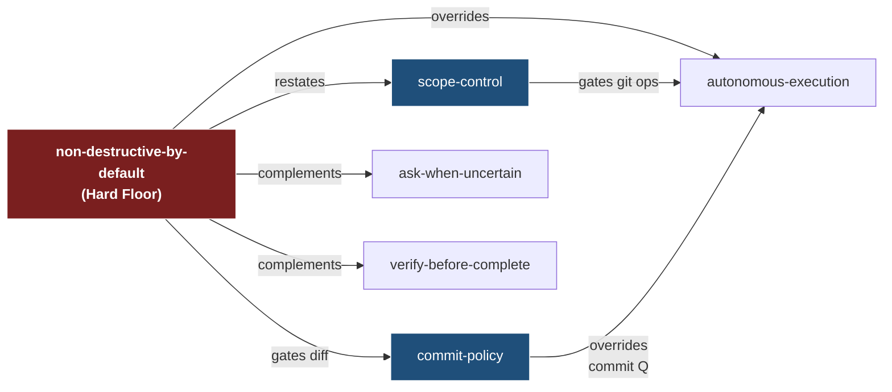

# Rule-Interaction Matrix

> **Audience:** rule authors and reviewers — anyone editing
> `src/rules/*.md` or proposing a new always-rule.
> **Authoritative source:** [`rule-interactions.yml`](rule-interactions.yml).
> **Linter:** `src/scripts/lint_rule_interactions.ts` (run via `task lint-rule-interactions`).

The matrix captures how the package's rules relate when more than one
fires on the same turn. It exists because rules at this size (111 rules,
9 of them always-loaded) develop emergent precedence relationships that
no single rule file can document on its own.

## What this register does NOT cover

**It records arbitration decisions that have been explicitly written down.
It does not claim completeness over the contradictions between artifacts.**
An unclaimed contradiction — two rules pushing opposite answers in
non-overlapping words, neither naming the other — is invisible to it, and
that gap is structural rather than an oversight: a static detector for
undeclared conflicts was built and measured against this corpus, and it
returned 67 % false positives at the only operating point with full
recall, with the co-firing signal *anti-correlated* with real conflict.
So detection stays a periodic human audit; this file holds what those
audits, and the rules themselves, resolved.

The linter enforces one closure property over that honest scope: **for the
rules this file declares, a precedence claim between two of them must have
a row.** The register is answerable for the set it covers and silent about
the rest. Extending `rules:` therefore widens the obligation — which is the
intended cost, and is exactly how three unrecorded subordinations surfaced
when the set last grew.

## The arbitration litmus

Before adding a row, apply it:

> **If one artifact must arbitrate between them, they are not
> complementary.**

A pair that needs no arbiter — two rules that push toward the *same*
response for different reasons — is `complements`, and the row's job is to
say so plainly so a future reader does not invent a precedence that was
never needed. A pair where a turn cannot satisfy both as written needs a
named winner **and a named decision domain**: which kind of decision the
senior rule governs, not a global rank. Ninety-seven per cent of the
precedence claims in the corpus are situated in exactly this way; the
three that assert naked global precedence are already encoded in
[`agent-authority`](../../src/rules/agent-authority.md)'s band table and
belong there rather than here.

The anchor pair is `non-destructive-by-default` — the universal safety
floor — paired with the five rules most likely to be invoked in the
same turn:

- `autonomous-execution` — autonomy never lifts the floor.
- `scope-control` — git-ops permission gate; floor is the never-overridable subset.
- `commit-policy` — four exception paths to commit; floor still gates the diff content.
- `ask-when-uncertain` — both rules push toward the same response on a destructive ambiguous request.
- `verify-before-complete` — independent gates; both must be satisfied.

## Diagram


```mermaid
graph LR
  NDD["non-destructive-by-default<br/>(Hard Floor)"]
  AE["autonomous-execution"]
  SC["scope-control"]
  CP["commit-policy"]
  AWU["ask-when-uncertain"]
  VBC["verify-before-complete"]

  NDD -- "overrides" --> AE
  NDD -- "restates" --> SC
  NDD -- "gates diff" --> CP
  NDD -- "complements" --> AWU
  NDD -- "complements" --> VBC

  SC -- "gates git ops" --> AE
  CP -- "overrides<br/>commit Q" --> AE

  classDef floor fill:#7a1f1f,stroke:#fff,color:#fff,font-weight:bold
  classDef gate fill:#1f4f7a,stroke:#fff,color:#fff
  class NDD floor
  class SC,CP gate
```

## Relations

The YAML uses six relation kinds. Definitions:

| Relation | Meaning |
|---|---|
| `overrides` | Senior rule's outcome wins when both fire — junior's permission cannot proceed past senior's stop. |
| `narrows` | Senior shrinks the surface area on which junior applies, but does not stop it. |
| `defers_to` | Junior explicitly hands over to senior on the overlapping surface. |
| `restates` | The two rules cover overlapping ground intentionally — the restatement prevents future weakening of one side. |
| `gates` | Senior fires *in addition to* junior on a specific subset, not instead of. |
| `complements` | Both rules independently apply; outcomes are additive and harmonious. |

## Reading a pair entry

```yaml
- id: ndd-x-autonomous-execution
  rules: [non-destructive-by-default, autonomous-execution]   # senior, junior
  relation: overrides
  conflict: …                                                  # what triggers both
  resolution: …                                                # what the agent does
  evidence:
    - .agent-src.uncondensed/rules/non-destructive-by-default.md#the-iron-law
    - .agent-src.uncondensed/rules/autonomous-execution.md#hard-floor--see-non-destructive-by-default
```

`rules: [a, b]` is ordered: `a` is senior (wins on conflict), `b` is
junior (yields). For `complements`, ordering is documentary only.

## Adding a new pair

1. Edit `rule-interactions.yml`, append a pair under `pairs:` with all
   six required fields.
2. Add both rule slugs to the top-level `rules:` block if not already
   listed.
3. Run `task lint-rule-interactions` — must exit 0.
4. Update the Mermaid diagram above if the pair is anchor-relevant
   (involves `non-destructive-by-default` or one of its five partners).
5. Reference the matrix from the rule files that are involved (one
   line each — the matrix is the source, not the rules).

## When **not** to add a pair

- Two rules that never fire on the same turn — no interaction means
  no entry; the matrix is for *active* relationships.
- Documentation-only cross-references (e.g. "see also") — those stay
  in the rule files.
- Skill ↔ rule interactions — the matrix is rule-only. Skills are
  invoked, not always-active.
- **Orchestration-layer surfaces** (AI Council, Memory, Work-Engine /
  Decision-Engine): these are runtime systems, not `always`-rules.
  Their interactions are governed by their own contracts and stay
  out of this matrix by design — see "Out of scope" below.

## Out of scope — orchestration surfaces (Council × Memory × Work-Engine)

The matrix is **rule-only**. The orchestration layer is governed by
dedicated contracts; cross-referencing them here would duplicate the
source of truth and weaken it. Canonical contracts:

| Surface | Canonical contract |
|---|---|
| Decision-Engine gates (`min_confidence`, `block_on_risk`, `require_memory_hits`, `on_block`) | [`decision-engine-gates.md`](decision-engine-gates.md) |
| Decision-trace shape (what the engine emits per phase) | [`decision-trace-v1.md`](decision-trace-v1.md) |
| Memory contract (entries, scopes, retention) | [`../guidelines/agent-infra/memory-access.md`](../guidelines/agent-infra/memory-access.md) |
| Memory visibility in the trace (`affected` keys) | [`memory-visibility-v1.md`](memory-visibility-v1.md) |
| AI-Council consultation flow | [`../skills/ai-council/SKILL.md`](../../.agent-src.uncondensed/skills/ai-council/SKILL.md) |

Where an `always`-rule **does** interact with one of these surfaces
(e.g. `non-destructive-by-default` gating a memory-driven action), the
gate lives in the rule and the precedence is captured in this matrix
as a rule-pair (the orchestration surface is the *occasion*, not a
participant). For Council ↔ Memory ↔ Work-Engine interactions among
themselves, the dedicated contracts above are authoritative.

## See also

- [`docs/contracts/STABILITY.md`](STABILITY.md) — public-surface stability tiers.
- [`docs/contracts/adr-chat-history-split.md`](adr-chat-history-split.md) — ADR pattern for major rule structural changes.
