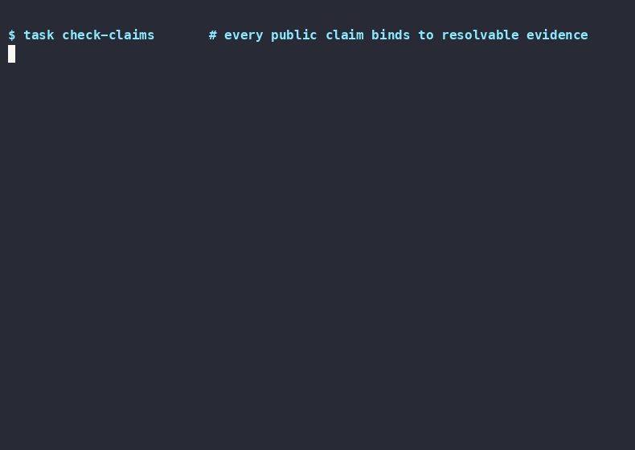

<!-- GENERATED by src/scripts/build_proof.ts — do NOT hand-edit.
     Drift-checked in CI (`task build-proof-check`). Regenerate with
     `./scripts-run src/scripts/build_proof` after editing docs/CLAIMS.md. -->

# Proof — verify our claims yourself

We sell falsifiability, so the selling is machine-checked. Every
public claim binds to resolvable evidence; a skeptic can reproduce
every check below on a fresh checkout. This page is itself generated
from those sources and fails CI if it drifts.

## See it run (< 60s, real output)



The recording is of the exact commands in § 5, nothing staged. Its
commands are re-executed in CI (`.github/workflows/proof-demo.yml`), so a
demo that showed something broken would turn CI red — the recording
cannot drift from current behavior.

## 1. Every public claim binds to evidence

Rendered from [`docs/CLAIMS.md`](CLAIMS.md). A `<!-- claim:ID -->` marker in
README/docs must resolve to a `backed` entry here with a resolving
evidence pointer, or `task check-claims` fails the build.

| Claim | Kind | Evidence | Resolves |
|---|---|---|---|
| On a weak host (claude-haiku-4-5) the package produces a significant, placebo-controlled discipline lift on scope/downstream traps; on a strong host the same measurement is a published null — the package transplants discipline a weak model lacks, not model intelligence. | quant | `docs/benchmark.md#weak-host-specific` | ✅ |
| The whole layer is compiled into host agents with zero runtime daemon. | qual | `docs/contracts/no-runtime-boundary.md#file-first, no-runtime suite` | ✅ |
| Removes only its own keys from a shared host config (matched by JSON-pointer + SHA-256), never a neighbour tool's entries. | qual | `docs/contracts/install-layout.md#JSON-pointer` | ✅ |

**3 backed claim(s)** — all evidence pointers resolve in CI.

We also publish our **debt**: 4 claim(s) are logged as
`unbacked` inventory in the ledger — not yet bound, and therefore not
allowed to carry a marker in public prose. Hiding them would be the
opposite of the point.

## 2. We publish honest nulls

Benchmark results — **including the runs where the package changed nothing** —
live in [`docs/benchmark.md`](benchmark.md). We do not delete a measured null to
make a number look better; the null is the evidence of honesty.

## 3. Known limits (published, witness-tested)

Each limitation below is stated by the skill itself and carries a witness
test that reproduces it. If the limitation is ever fixed, its witness goes
red — so a "Known limit" can never quietly become false.

| skill | known limit | witness |
|---|---|---|
| `check-refs` | Only validates references to known-root paths (docs/, skills/, rules/, commands/, contexts/, personas/, …). A relative-path link such as `./sibling.md` or `../foo.md` is not matched, so a broken relative link is never reported. | [`tests/scripts/witness/check_refs_relative_gap.test.ts`](../tests/scripts/witness/check_refs_relative_gap.test.ts) |

## 4. What is checkable — us vs. the category

This is not a takedown — the point is the last column. For each claim,
our evidence is a pointer you can resolve on a fresh checkout; the wider
category is described only by what is publicly observable, never a named
competitor and never a counter-claim to anyone's headline number. A claim
is "checkable" only when its `our evidence` pointer resolves — CI enforces
that (`task check-comparison`), so this column can never lie.

| Claim | Our evidence | The category | Checkable? |
|---|---|---|---|
| No runtime — no background daemon, no state database, no auto-write memory. | [`docs/contracts/no-runtime-boundary.md#file-first`](../docs/contracts/no-runtime-boundary.md) | Swarm-runtime tools in this category ship a background process and/or a state store by design; that is an architectural fact of the runtime approach, not a defect. | ✅ |
| Capability/benchmark results are published — including the runs where the package changed nothing. | [`docs/benchmark.md`](../docs/benchmark.md) | A category headline figure (e.g. an '84.8%' score) appears across marketing surfaces with no reproducible methodology published — so it cannot be verified either way. | ✅ |
| Every public claim binds to machine-checked evidence. | [`docs/CLAIMS.md`](../docs/CLAIMS.md) | Marketing claims in this category are not bound to a machine-checked ledger a reader can reproduce. | ✅ |
| Skills publish their own known limits, each with a witness test. | [`tests/scripts/witness/check_refs_relative_gap.test.ts`](../tests/scripts/witness/check_refs_relative_gap.test.ts) | Published known-limitation surfaces backed by reproducing tests are not a standard artifact in this category. | ✅ |

## 5. Verify it yourself

On a fresh checkout, reproduce the claims above:

```bash
task check-claims   # every markered public claim binds to resolvable evidence
task check-refs     # no broken internal references
task check-skill-gaps    # every logged known-limit cites a real witness test
task check-comparison    # every comparison-table "our evidence" pointer resolves
task build-proof-check   # this page is in sync with its sources
```

If a claim ever loses its binding, or this page drifts from the ledger,
CI goes red. Reproducibility is the proof.
