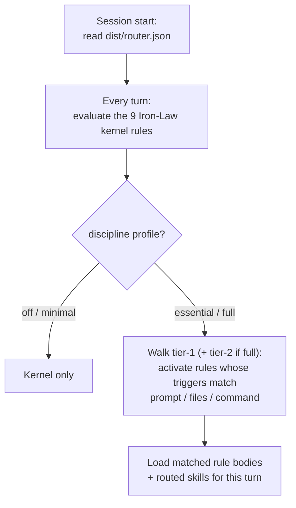

Rules split into two layers: a small **kernel** that always loads, and a larger
set the **router** activates on demand.

## The kernel — 9 Iron-Law rules

The kernel is a fixed set of **9 Iron-Law rules** loaded on **every** session,
unconditionally, in every profile. They can never be overridden by a skill,
command, or guideline:

`agent-authority` · `ask-when-uncertain` · `commit-policy` · `direct-answers` ·
`language-and-tone` · `no-cheap-questions` · `non-destructive-by-default` ·
`scope-control` · `verify-before-complete`.

Membership requires an Iron-Law fence, mode-independence, a pre-send/pre-act
gate, and cross-cutting scope; each fence is SHA-locked so edits cannot silently
weaken it (see
[`kernel-membership.md`](https://github.com/event4u-app/agent-config/blob/main/docs/contracts/kernel-membership.md)).

## The router

Every **non-kernel** rule declares, in frontmatter:

- `triggers:` — keyword / phrase / intent / file-pattern / path-prefix / command.
- `routes_to:` — the artifact that carries its body (`skill:` / `guideline:` /
  `command:` / `contract:`).

A compiler reads all rule frontmatter and emits **`dist/router.json`** — a
deterministic lookup table with `kernel`, `tier_1`, `tier_2`, and `profiles`.

## How a rule loads

1. The host reads `dist/router.json` once at session start.
2. Every turn, it evaluates the kernel.
3. If the discipline profile is `off`/minimal, it stops there.
4. Otherwise it walks tier-1 (and tier-2 when `full`), activating any rule whose
   triggers match the prompt, open files, or invoked command — loading its body
   and routed skills for that turn.

There is no runtime profile resolution; matching is pure keyword/phrase/path/
intent lookup. See
[`rule-router.md`](https://github.com/event4u-app/agent-config/blob/main/docs/contracts/rule-router.md)
for the full contract, and
[Configuration → Profiles](/agent-config/configuration/profiles/) for how the
discipline profile selects tiers.
