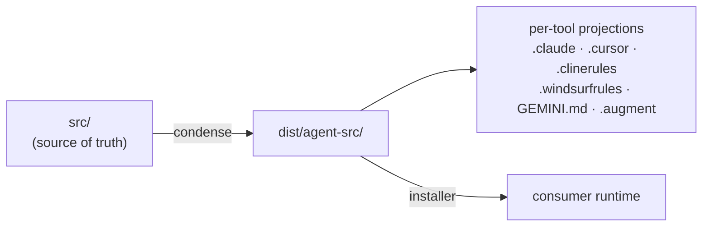

**`src/` is the single source of truth** — `src/skills/`, `src/rules/`,
`src/agent-src/` (profiles, commands, contexts, personas, packs),
`src/domains/`, `src/scripts/`. Everything else is a **generated projection**:
equal, derived, and never authoritative.

## The generation chain

## Regeneration

| Command | Regenerates |
|---|---|
| `task sync` | `dist/agent-src/` + `.augment/`; refreshes counts/settings |
| `task generate-tools` | `.claude/`, `.cursor/`, `.clinerules/`, `.windsurfrules`, `GEMINI.md` |
| `/condense` | the `src/` → `dist/` condensation (hashing + sync verification) |

## The Iron Rule

> **Never create or edit a generated projection.** Direct edits break
> condensation hashes, fail CI, and are overwritten on the next regeneration.
> Always edit `src/`, then regenerate.

No tool is privileged — Claude, Cursor, Augment, Cline, Windsurf, Gemini are all
just projection targets. See
[`source-of-truth.md`](https://github.com/event4u-app/agent-config/blob/main/dist/agent-src/rules/source-of-truth.md)
and the
[system map](https://github.com/event4u-app/agent-config/blob/main/docs/maintainers/system-map.md).
